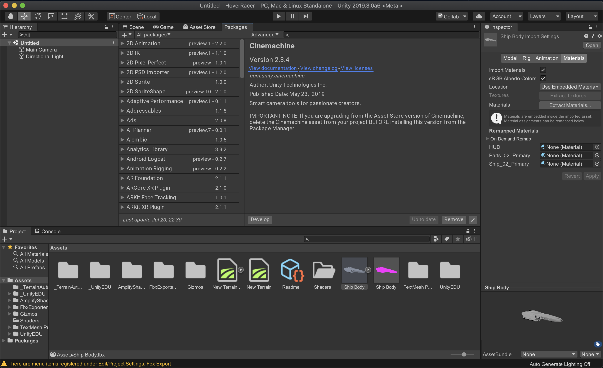

# VRDataScience
VR DataScience Collector using GoogleVR SDK for Unity and Firebase as backend database. 

# Unity Setup
1. Legacy Installation:
  1. Unity > Window > Package Manager
    1. Advanced > Show preview packages
      1. Cinemachine (install/update)
      1. Post-processing (install/update)
      1. ShaderGraph (install/update)
      